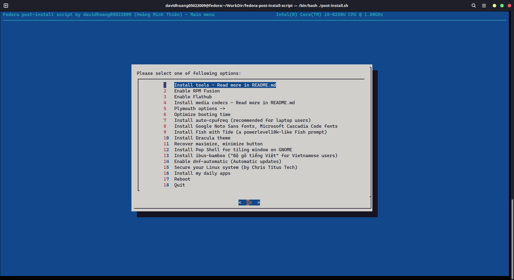
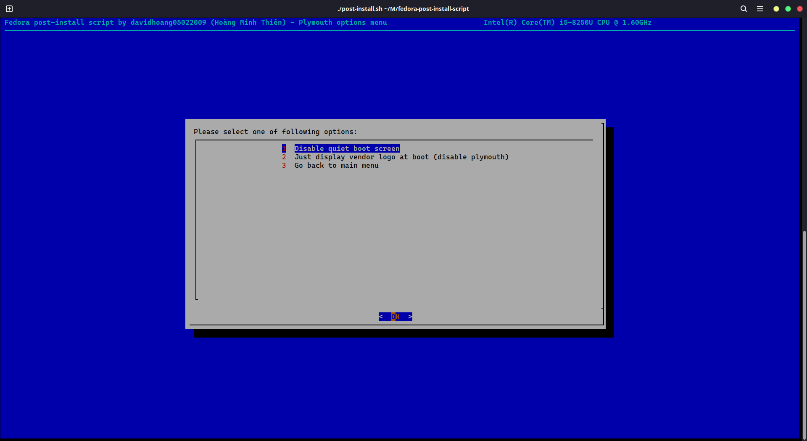

<!-- ./README.md -->
<!-- SPDX-License-Identifier: GPL-3.0-or-later -->

<!--
fedora-post-install-script
Copyright (C) 2022 davidhoang05022009(Hoàng Minh Thiên)
This program comes with ABSOLUTELY NO WARRANTY
This is free software, and you are welcome to redistribute it
under certain conditions

Licensed under GPLv3 License
-->

# fedora-post-install-script

#### Note: This script is only compatible on Fedora GNOME (The default DE for Fedora Workstation)
> **Warning**
> School year has begun, so the development of this project is temporarily suspended (I can just write a bit of code when I'm free) and bugs expected. So please kindly report it in the GitHub issues or even better, create a PR that helps fix the bug. I'll appreciate your work, thank you ^^

## Screenshots




## How to run?

1. Make sure `git` is usable<br>
   If not, install it:

```sh
sudo dnf install git -y
```

2. Open Terminal, type:

```sh
git clone https://github.com/davidhoang05022009/fedora-post-install-script
cd ./fedora-post-install-script
```

3. Run it:

```sh
chmod u+x ./post-install.sh
./post-install.sh
```

## What can this script do?

1. Speed-up and optimize `dnf`
2. Check update for your system
3. Install some tools, includes: `htop`, `neofetch`, `xclip`, `axel`, `gnome-tweaks`, `deltarpm`, `micro`, `code` (VSCode), `dnf-automatic`, `unzip`, `gh` ([GitHub CLI](https://cli.github.com/)), `github-desktop`, `kitty`
4. Enable RPM Fusion, Flathub
5. Install media codecs (from the docs [here](https://docs.fedoraproject.org/en-US/quick-docs/assembly_installing-plugins-for-playing-movies-and-music/))
6. Disable "quiet" boot screen and optimize boot time (make your boot screen look like hacker's screen XD) (make some changes to GRUB config file, don't worry, I tested it and it's fine)
   <br>(My laptop is using SSD, it takes only 5 seconds to boot up after optimize)
7. Install [auto-cpufreq](https://github.com/AdnanHodzic/auto-cpufreq) for laptop users
8. Install Google Noto Sans fonts, Microsoft Cascadia Code fonts, Fish shell with Fisher and Tide, Dracula theme, etc.
9. Recover the maximize and minimize button (disabled by default)
10. Install GNOME Extensions like [Pop Shell](https://github.com/pop-os/shell), [AppIndicator](https://github.com/ubuntu/gnome-shell-extension-appindicator) and [SoundOutputDeviceChooser](https://github.com/kgshank/gse-sound-output-device-chooser)
11. Secure your Linux system by setting up ufw, fail2ban (This one is from Chris Titus Tech)
12. Install ibus-bamboo
13. Install my daily apps, includes AnyDesk, VLC, OBS Studio, @Virtualization, Shotcut, Seahorse (GNOME built-in password manager), Discord, Signal, Telegram, Remmina, GeoGebra, Bitwarden, `variety` for automatic background changing and `clang`, `cmake`, `gtk3-devel`, `ninja-build`, `pkg-config`, `xz-devel` for Flutter development, Docker rootless and Docker Desktop, Firefox and Google Chrome from Flatpak (which **WILL REMOVE THE NORMAL GOOGLE CHROME AND FIREFOX PACKAGE**, and then set Firefox as the default browser)

## Found an issue?

Create an issue with `Bug report` template

### Special thanks to all creators, all organizations and all contributors of all 3rd party apps and library included or will be install using this script.

## License

This repository is licensed under GPLv3 License, see it [here](./LICENSE)</br>
Copyright (C) 2022 davidhoang05022009(Hoàng Minh Thiên)</br>
This program comes with ABSOLUTELY NO WARRANTY</br>
This is free software, and you are welcome to redistribute it
under certain conditions

Please note that I am using a GPG signature to verify commits now (for security reasons in the future)
